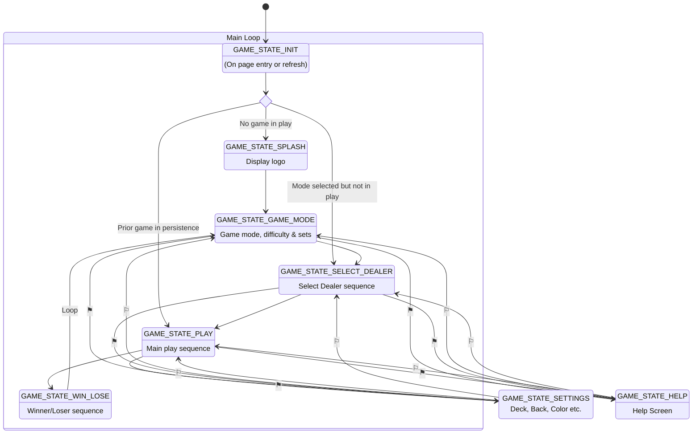
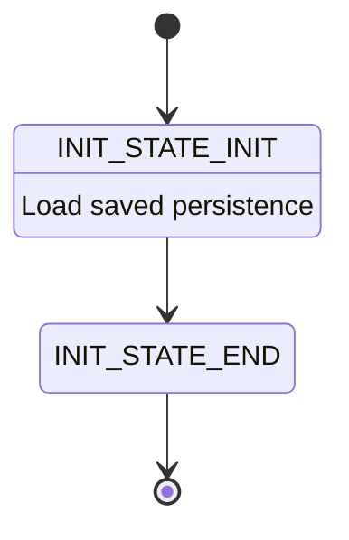
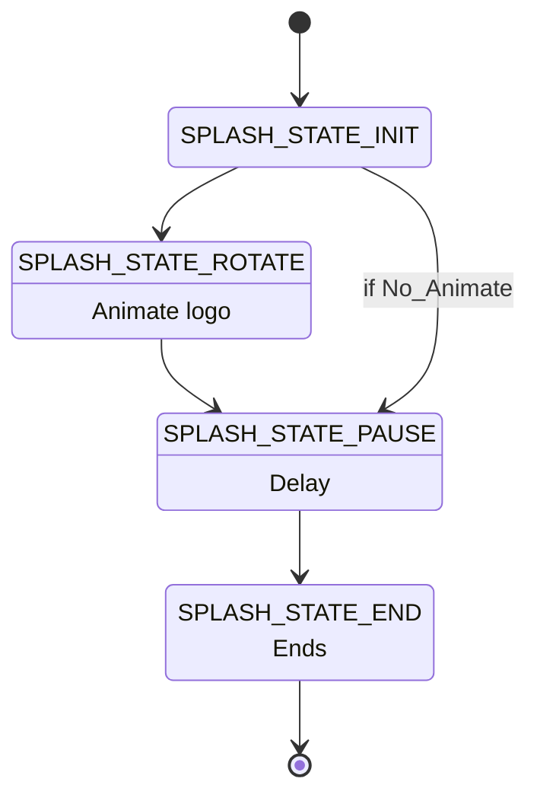
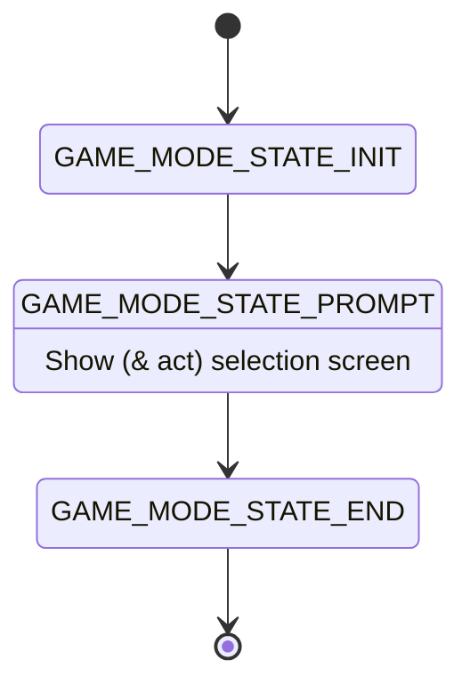
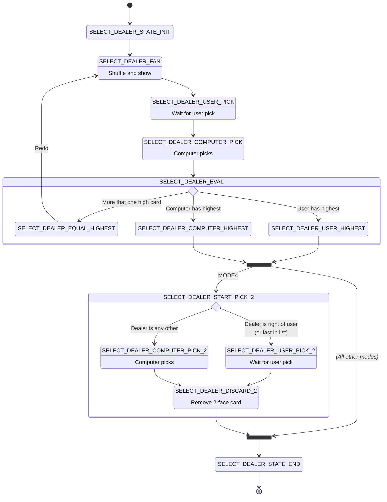
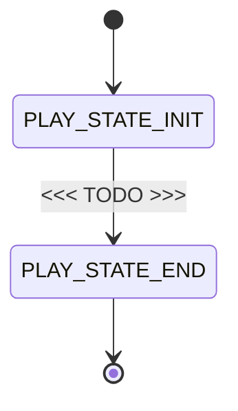
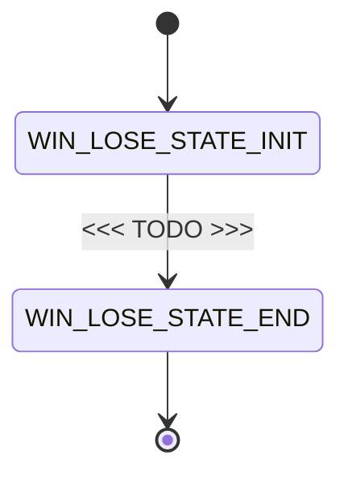
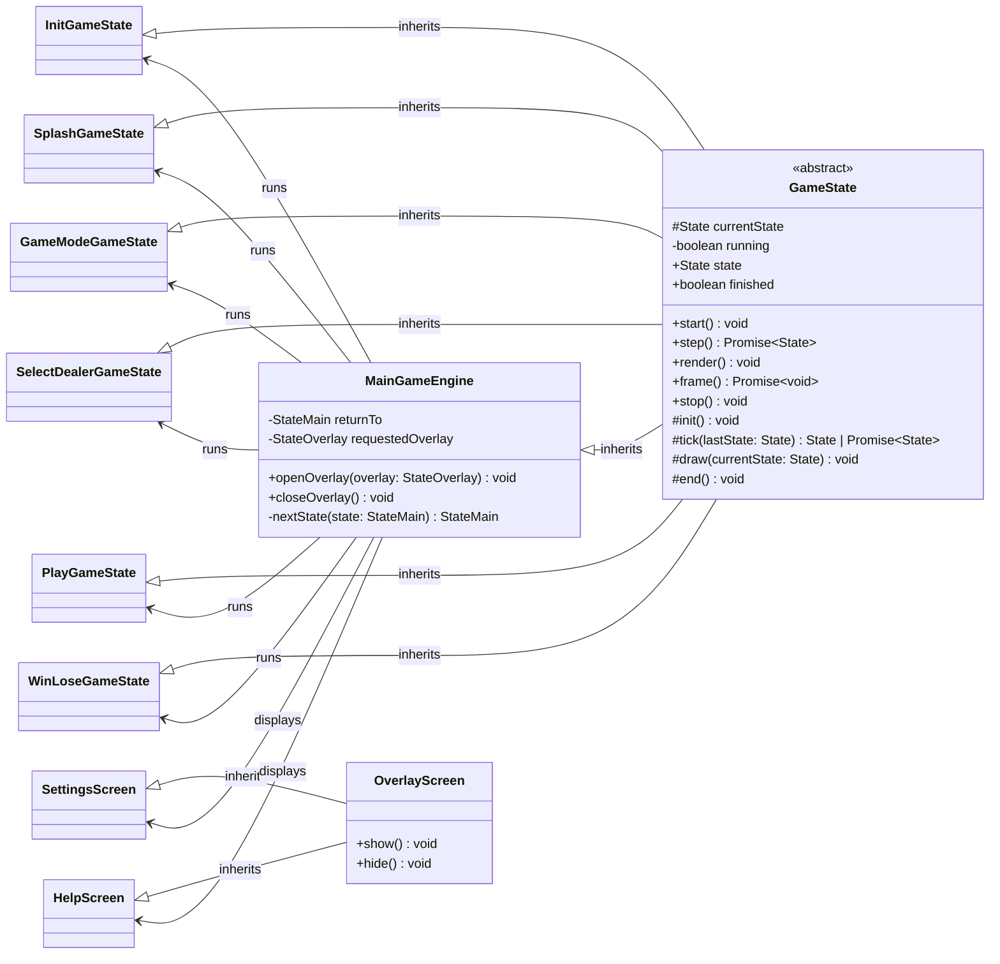
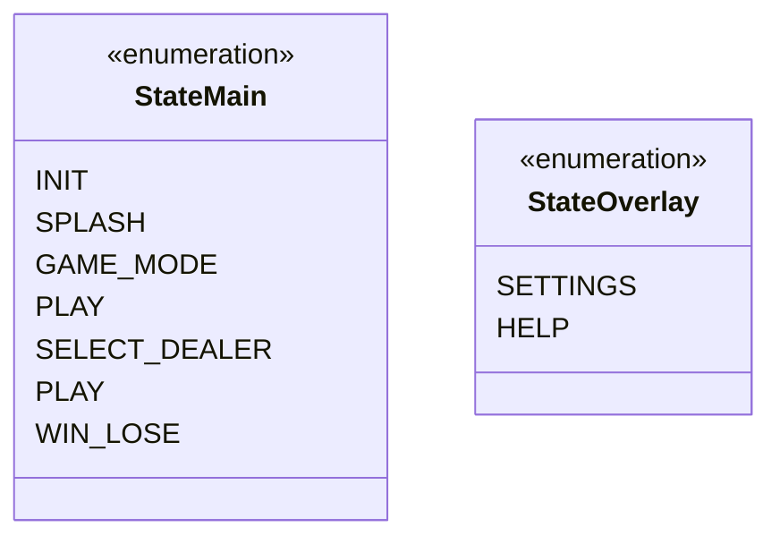

# Main Game Engine 

Nested **state engines** used.  The main loop is the main game state.  This is a core engine file.  Each node then is written as a separate file. 

Within each file there is it's own *mini* state engine.  Each node therein is a separate function.

The application runs the main engine in a cooperative asynchronous loop. Each
`tick()` either returns immediately when its state can progress, or awaits the
event that allows a waiting state to continue. This keeps the browser responsive
without polling or tying game progression to display animation frames.

## Main State Engine

*Note:* **⚑⚐** → Both `SETTINGS` and `HELP` can be selected at any time, and return to calling state when done.

## `INIT` Mini State Engine

## `SPLASH` Mini State Engine

## `GAME_MODE` Mini State Engine

## `SELECT_DEALER` Mini State Engine

## `PLAY` Mini State Engine

## `WIN_LOSE` Mini State Engine

## Class Diagram

## Interfaces & Enums

