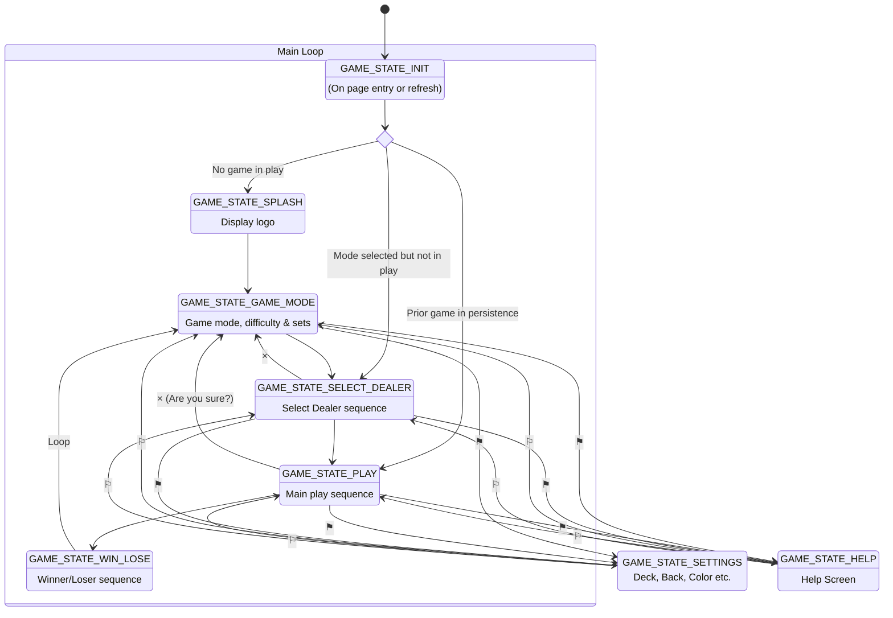
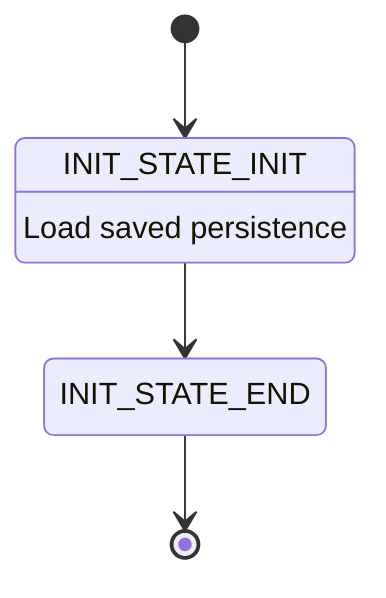
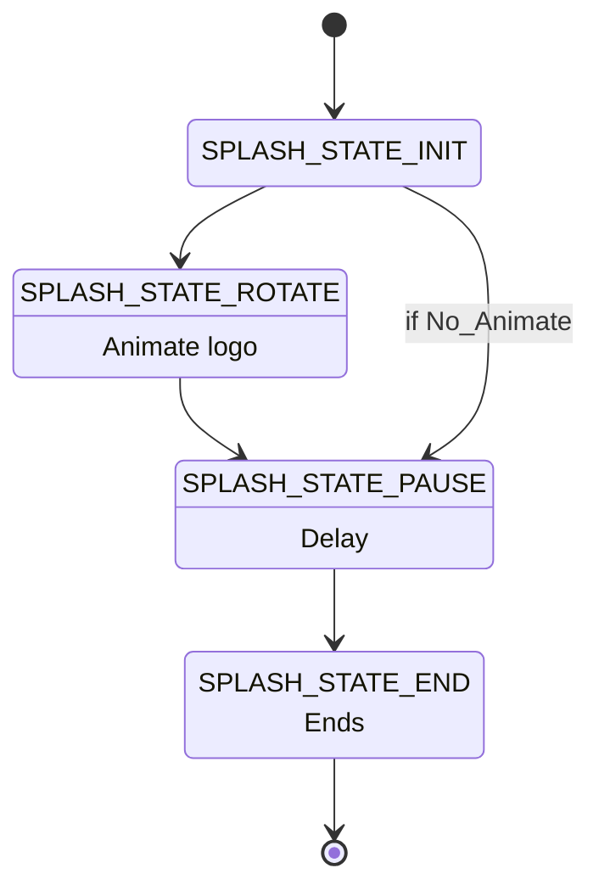
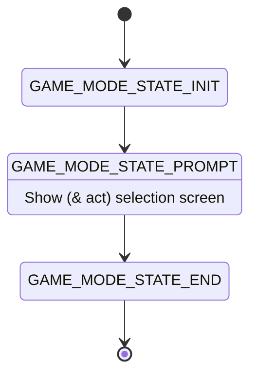
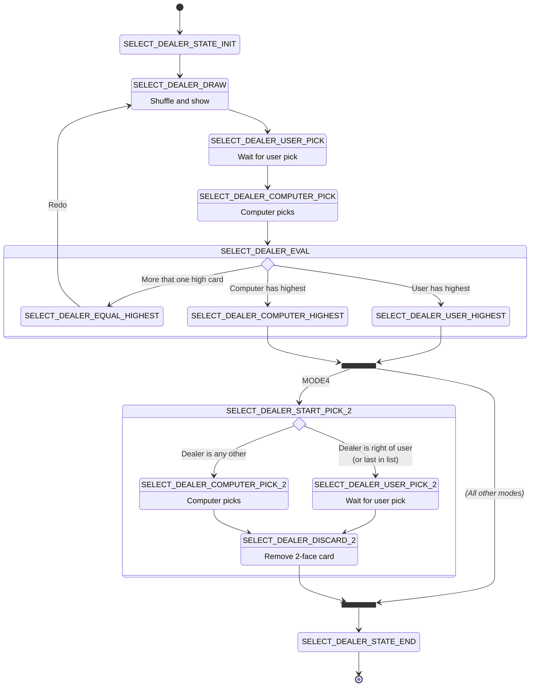
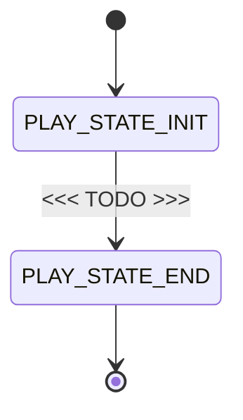
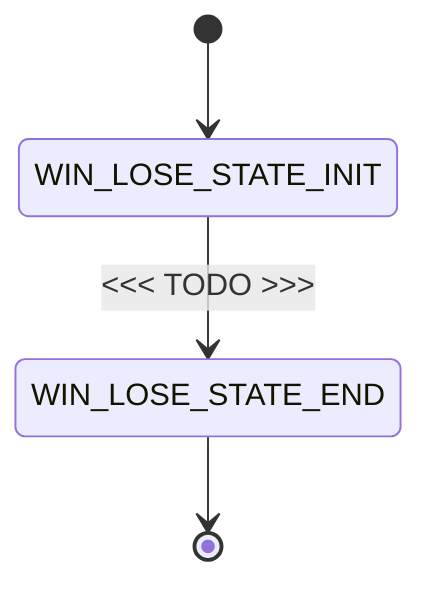
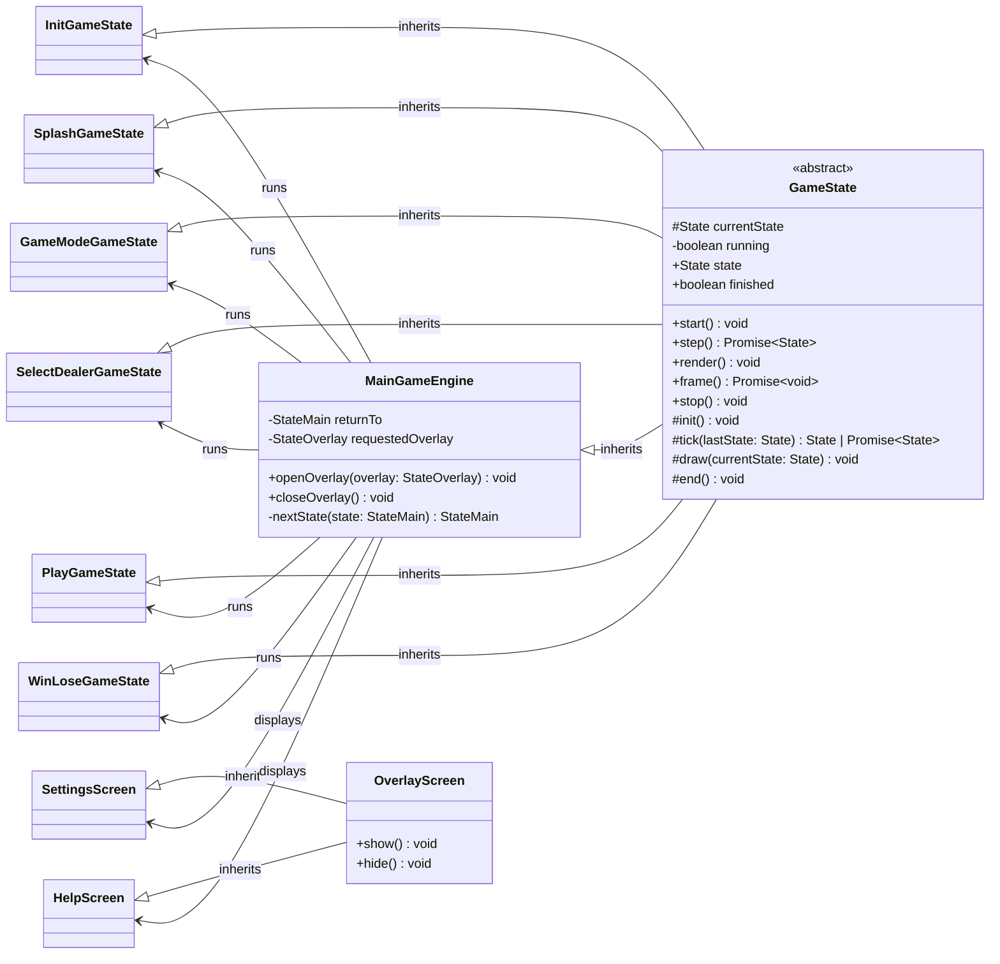
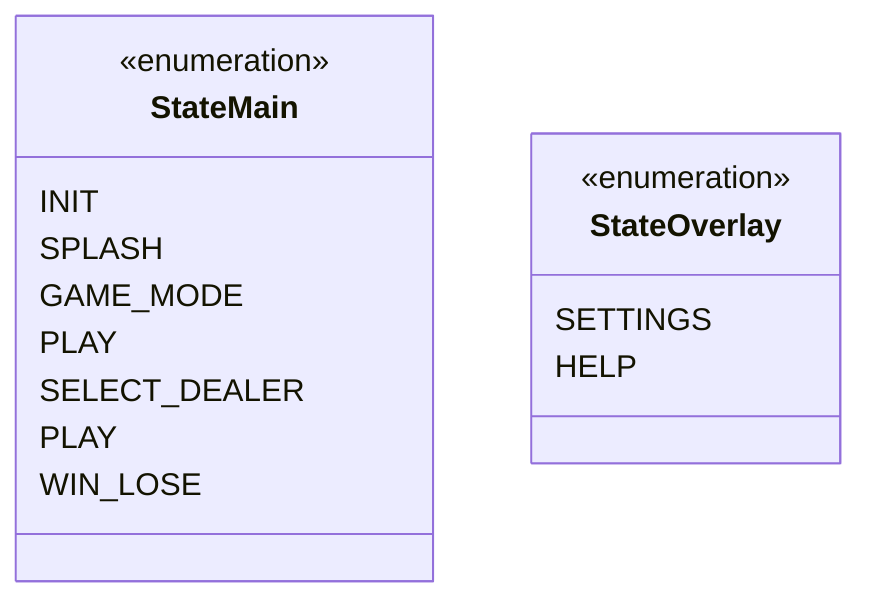

# Main Game Engine 

This project uses nested **state engines**. The main loop is the main game state. This is a core engine file. Each node is written as a separate file.

Within each file there is its own *mini* state engine. Each node in it is a separate function.

The application runs the main engine in a cooperative asynchronous loop. Each state runs a tick, then a draw, then a wait, in that order, and repeats this until it is ready to move on. This design keeps the browser responsive. It does this without polling and without tying game progress to display animation frames.

**The important thing to understand about this engine** is that it is not an infinite loop or a graphics rendering engine. It is a DOM management engine. This app only draws with native HTML and CSS components: div, img, svg, and CSS absolute or relative coordinates. The state engine does the following:
- On enter: `init` sets up initial variables. It also prepares the first `draw` call in the running loop. This lets the loop render visual items on the DOM, such as cards, dialogs, and buttons.
- On "running": this runs just after `init`, and each time the loop needs it.
    - `tick` handles internal, non-UI tracking, such as card deck changes and settings save or retrieve operations.
    - `draw` applies DOM changes: it adds or removes items and changes their locations.
- On exit: `stop` removes all the DOM UI items.

This loop must block. It also needs a trigger event to loop again: trigger, then tick, then draw, then wait for the next trigger.

**Hard rule:** `tick()` must not wait for anything on its own. It is the non-UI worker. It reads any data the last trigger delivered. It returns the same state to mean stay, or a different state to mean move on now. `draw()` runs after every tick, whether or not the state changed, so the node paints its current state before the loop can block. The wait step comes after `draw()`. It blocks the loop until the next trigger, and only then does the loop run `tick()` again.

`GameState` gives every node the same building blocks for this, so no node writes its own resolver bookkeeping:
- `step()` runs the tick, draw, and wait steps in a loop. It repeats until `tick()` returns a state that differs from the state the node held at the start of that pass.
- When a node needs trigger data, `tick()` reads the latest one from `this.lastTrigger`.
- An event handler, from `reactions.ts`, a timer, or similar, calls `node.trigger(payload)`. This is the one well-known call that makes the loop cycle over: it stores the payload in `this.lastTrigger` and releases the pending wait.

A node with no payload uses `GameState<StateMain>` (`TriggerPayload` defaults to `void`) and calls `node.trigger()`. A node whose trigger carries data, such as the chosen game mode, extends `GameState<StateMain, GameMode>`, and its `tick()` reads that data from `this.lastTrigger`. See `src/core/state-mode.ts` for the reference example.

## Main State Engine

*Note:* **⚑⚐** → You can select both `SETTINGS` and `HELP` at any time. When one finishes, it returns to the calling state.

**How ⚑⚐ works:** Opening an overlay is an interrupt, not a normal transition. `gameEngine.openOverlay(state)` stops whatever node is current, pushes it onto a FILO stack, and starts the overlay. This works from any node, at any time, because it does not go through that node's own `tick()`. `SETTINGS` and `HELP` can open each other the same way, so the stack can hold more than one saved node.

Closing an overlay IS a normal transition, driven by that overlay's own `tick()`. The global close button calls `trigger()` on the active overlay node. Its `tock()` sees `this.triggered` and returns `StateMain.RESUME`. `StateMain.RESUME` is not a real screen: the engine reads it as "pop the FILO stack and continue whatever node this overlay interrupted," restarting that node with `start()`.

## `INIT` Mini State Engine

## `SPLASH` Mini State Engine

## `GAME_MODE` Mini State Engine

## `SELECT_DEALER` Mini State Engine

## `PLAY` Mini State Engine

## `WIN_LOSE` Mini State Engine

## Class Diagram

## Interfaces & Enums

