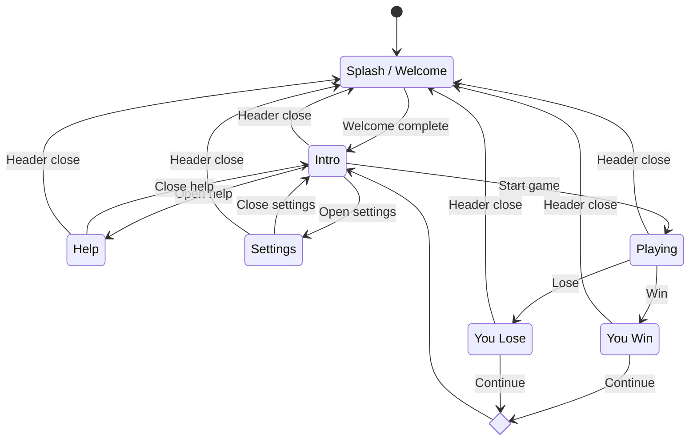

# Screen state

The current screen is stored in the `bisca.game` persistence section. Screen changes must follow the transitions below.

```mermaid
stateDiagram-v2
    [*] --> Welcome
    state "Splash / Welcome" as Welcome
    state "You Win" as YouWin
    state "You Lose" as YouLose
    state ResultsComplete <<choice>>

    Welcome --> Intro: Welcome complete
    Intro --> Help: Open help
    Help --> Intro: Close help
    Intro --> Settings: Open settings
    Settings --> Intro: Close settings
    Intro --> Playing: Start game
    Playing --> YouWin: Win
    Playing --> YouLose: Lose
    YouWin --> ResultsComplete: Continue
    YouLose --> ResultsComplete: Continue
    ResultsComplete --> Intro
    Intro --> Welcome: Header close
    Help --> Welcome: Header close
    Settings --> Welcome: Header close
    Playing --> Welcome: Header close
    YouWin --> Welcome: Header close
    YouLose --> Welcome: Header close
```
